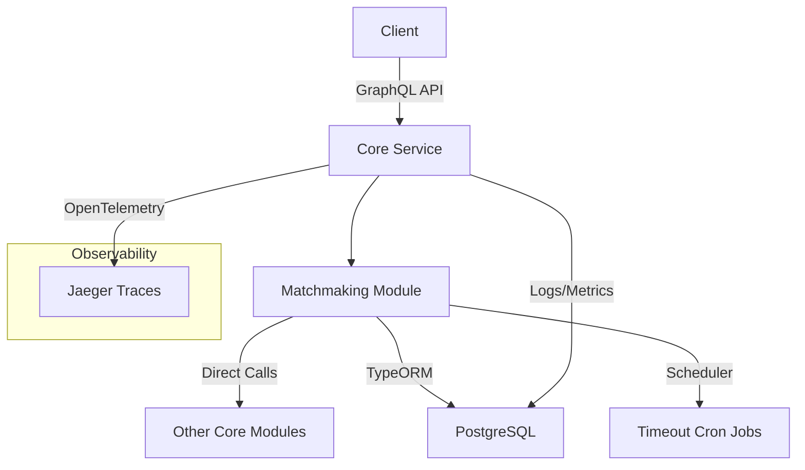

# Matchmaking Service Migration to Core Monolith

## Conceptual Design Summary

Based on the unified migration plan and matchmaking documentation:

### Current Architecture
- Standalone microservice using Redis for queue state management and RabbitMQ for events.
- Handles player matchmaking, scrim management, queue operations, and timeouts.
- Key components: Queue management, skill-based matching, scrim lifecycle, timeout handling.

### Target Architecture
- Integrate into Core service as a monolith module (`core/src/matchmaking/`).
- Replace Redis with PostgreSQL tables for queue and timeout state.
- Replace RabbitMQ with direct function calls within Core.
- Leverage Core's existing TypeORM, cron system, and observability features.

### High-Level Benefits
- Simplified architecture with reduced dependencies.
- Direct integration enables better data consistency and performance.
- Full utilization of Core's PostgreSQL-only event system for any remaining inter-service needs.

## Detailed Implementation Decisions

### Schema Integration
Adopt and extend the proposed ScrimQueue and ScrimTimeout entities:
```typescript
@Entity()
class ScrimQueue {
  @PrimaryGeneratedColumn('uuid')
  id: string;

  @ManyToOne(() => Player)
  player: Player;

  @ManyToOne(() => Game)
  game: Game;

  @Column()
  skillRating: number;

  @Column()
  queuedAt: Date;

  @Column({ type: 'enum', enum: QueueStatus })
  status: QueueStatus; // QUEUED, MATCHED, EXPIRED, CANCELLED

  @Column({ nullable: true })
  matchedAt: Date;

  @ManyToOne(() => Match, { nullable: true })
  match: Match;
}

@Entity()
class ScrimTimeout {
  @PrimaryGeneratedColumn('uuid')
  id: string;

  @ManyToOne(() => Player)
  player: Player;

  @Column()
  expiresAt: Date;

  @Column()
  reason: string;
}
```
- Add indexes for efficient querying (e.g., on status, queuedAt).
- Integrate with Core's multi-game data model for game-specific matching.

### Code Migration
- Move `services/matchmaking/src/` to `core/src/matchmaking/`.
- Replace Redis operations with TypeORM repositories.
- Convert RabbitMQ event publishing to direct method calls in Core modules.
- Integrate timeout logic into Core's existing cron system.
- Implement matchmaking algorithm as a Core service, supporting multi-game ELO.

### API and Integration Points
- Expose matchmaking endpoints via Core's GraphQL API.
- Use Core's RBAC for access control (e.g., player authentication).
- Integrate real-time updates via Core's WebSocket system.

## Required Changes to Fit into Core Binary

1. **Dependency Removal**:
   - Eliminate Redis client and related code.
   - Remove RabbitMQ configuration and event handlers.

2. **State Management**:
   - Migrate queue state from Redis to PostgreSQL tables.
   - Implement transactional operations using TypeORM for consistency.

3. **Timeout and Background Jobs**:
   - Use NestJS Scheduler for cron-based timeout checks.
   - Replace job queues with in-process scheduling.

4. **Error Handling and Validation**:
   - Align with Core's validation pipeline (Zod/TypeORM).
   - Integrate with Core's global error interceptor.

5. **Configuration**:
   - Move settings to Core's config system (e.g., queue timeouts, matching parameters).

## Tradeoffs Induced by Integration

### Advantages
- **Performance**: Direct database access and function calls reduce latency.
- **Simplicity**: Fewer services to deploy and monitor.
- **Consistency**: Shared data models ensure referential integrity.
- **Cost Savings**: No separate Redis instance required.

### Disadvantages
- **Monolith Complexity**: Core binary grows larger, potentially harder to maintain.
- **Scalability**: Horizontal scaling now applies to entire Core instead of isolated service.
- **Downtime Risk**: Bugs in matchmaking could affect Core functionality.
- **Testing Overhead**: Integrated tests become more complex.

### Mitigation Strategies
- Modularize code within Core (e.g., separate NestJS module).
- Use feature flags for gradual rollout.
- Implement comprehensive unit/integration tests.

## Observability Integration

Focus on comprehensive logging of state changes in queues and scrims, with automatic alerts for high error rates:

### Logging
- Use Core's ObservabilityInterceptor for automatic request logging.
- Add structured logs for key events (e.g., queue entry, match found, timeout).
- Store in PostgreSQL `logs` table with trace_id for correlation.

### Metrics
- Record queue times, match success rates, timeout occurrences.
- Use MetricsService to store in `metrics` table.

### Tracing
- Integrate with Jaeger via OpenTelemetry for end-to-end traces (e.g., player queue to match creation).

### Alerts
- Implement thresholds in observabilityAlerts (e.g., >5% error rate in matchmaking operations).
- Auto-notify via Core's notification system.

## Strategies for Robustness and Maintainability

1. **Code Organization**:
   - Service layer for business logic.
   - Repository layer for data access.
   - Clear separation of concerns (e.g., matching algorithm isolated).

2. **Error Handling**:
   - Comprehensive validation with graceful degradation.
   - Retry mechanisms for transient failures.

3. **Testing**:
   - Unit tests for algorithms.
   - Integration tests with test containers.
   - E2E tests for full workflows.

4. **Documentation**:
   - Inline comments and API docs.
   - Update v2-documentation-index.md.

5. **Monitoring**:
   - Health checks for queue status.
   - Performance baselines for matching operations.

## High-Level Architecture Diagram



## Migration Timeline and Tasks

### Phase 1: Preparation (Week 1)
- Review and update schemas.
- Migrate code structure.

### Phase 2: Implementation (Week 1-2)
- Replace Redis with TypeORM.
- Integrate timeouts and events.

### Phase 3: Observability and Testing (Week 2)
- Add logging, metrics, tracing.
- Comprehensive testing.

### Phase 4: Deployment (Week 2)
- Update docker-compose.
- Final validation.

This plan ensures a robust, observable, and maintainable integration of matchmaking into Core.